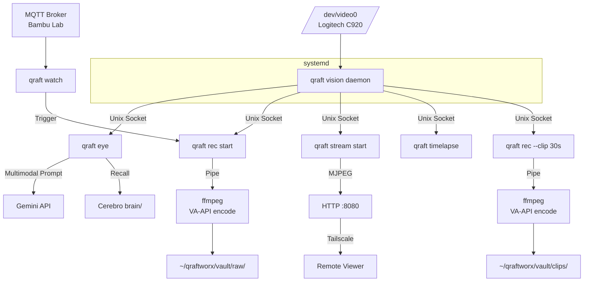

# Handoff: Principal Architect -> Implementation Engineer

## Phase Completed: 1 - Definition (Architecture) for NVS Feature

### References
- Branch: `architecture/nvs-feature-design`
- ADRs:
  - `docs/architecture/qraft-cli/design/nvs/ADR-NVS-001-vision-daemon-process-model.md`
  - `docs/architecture/qraft-cli/design/nvs/ADR-NVS-002-frame-sharing-mechanism.md`
- Interface Definitions: `docs/architecture/qraft-cli/design/nvs/nvs-interfaces.go`
- Main Spec: `docs/architecture/qraft-cli/design/nvs/nvs-architecture.md`

### Deliverables
- [x] Architecture Decision Records (ADRs) -- 2 ADRs covering process model and frame sharing
- [x] Interface/Contract Definitions -- Go interfaces for all NVS components
- [x] Component Diagram -- Full system diagram in main spec section 2
- [x] Data Flow Diagrams -- Eye (section 6.1), Recording (section 7.1), Streaming (section 8.1), Events (section 9.1)
- [x] Configuration Schema -- TOML additions in section 12.2
- [x] Security Analysis -- NVS-specific findings in section 15
- [x] Build Phase Plan -- Phases 9-13 in section 14

### Architecture Summary

NVS adds a vision daemon (`qraft vision daemon`) to the Qraft CLI that keeps a camera open continuously via an ffmpeg subprocess. The daemon maintains a JPEG ring buffer in memory and serves frames to consumers over a Unix domain socket with a simple length-prefixed protocol. Four consumer types exist:

1. **Eye** (`qraft eye`) -- Grabs a single frame, assembles a multimodal Gemini prompt with Cerebro context and sensor state, returns AI visual analysis.
2. **Chronicler** (`qraft rec`) -- Streams frames to an ffmpeg transcoding subprocess with Intel VA-API hardware acceleration, producing H.264/H.265 MP4 files.
3. **Viewport** (`qraft stream`) -- Relays frames as an MJPEG HTTP stream for remote viewing via Tailscale VPN.
4. **Event Triggers** (`qraft watch`) -- Monitors MQTT topics (e.g., Bambu Lab printer state changes) and fires configured actions (start/stop recording).

The daemon is a subcommand within the same `qraft` binary (ADR-NVS-001), managed by systemd. Frame sharing uses Unix domain sockets, not mmap (ADR-NVS-002). Recording, streaming, and event watching are separate processes, not part of the daemon -- providing fault isolation and independent lifecycle management.

### Component Diagram

### Key Interfaces Defined

| Interface | Purpose | File |
|-----------|---------|------|
| `RingBuffer` | Fixed-capacity circular frame buffer (single-writer, multi-reader) | nvs-interfaces.go |
| `FrameSource` | Abstraction over camera capture (ffmpeg v4l2, GoPro HTTP, test mock) | nvs-interfaces.go |
| `VisionClient` | Consumer-side socket client (Frame, Stream, Status, Clip) | nvs-interfaces.go |
| `VisionDaemon` | Producer-side daemon lifecycle (Run, Metrics) | nvs-interfaces.go |
| `Recorder` | Recording lifecycle management (Start, Stop, Status) | nvs-interfaces.go |
| `StreamServer` | MJPEG HTTP relay server (Start, Status) | nvs-interfaces.go |
| `EventWatcher` | MQTT trigger evaluator and action executor (Run) | nvs-interfaces.go |
| `MediaRetention` | Disk space management and cleanup (Cleanup, DiskUsage) | nvs-interfaces.go |
| `ImageAttachment` | Hydrator extension for multimodal Gemini prompts | nvs-interfaces.go |

### Technology Decisions

| Decision | Choice | ADR | Context7 Verified |
|----------|--------|-----|-------------------|
| Daemon process model | Subcommand in same binary + systemd | ADR-NVS-001 | N/A (Go stdlib) |
| Frame sharing IPC | Unix domain socket with length-prefixed protocol | ADR-NVS-002 | N/A (Go net stdlib) |
| Camera capture | ffmpeg subprocess (v4l2 input, MJPEG output) | NVS-D3 | N/A (external tool) |
| Gemini multimodal | `genai.Blob{Data: jpegBytes, MIMEType: "image/jpeg"}` via InlineData | NVS-D4 | Yes -- `google.golang.org/genai` |
| Hardware encoding | ffmpeg with VA-API (`h264_vaapi`, `/dev/dri/renderD128`) | NVS arch sec. 7 | N/A (external tool) |
| Streaming protocol | MJPEG over HTTP (multipart/x-mixed-replace) | NVS arch sec. 8 | N/A (HTTP standard) |
| Tailscale integration | Detection only, not management | NVS-D7 | N/A (external tool) |

### Implementation Notes

1. **Security finding S2 is paramount.** Every `exec.CommandContext` call for ffmpeg must use argument slices, never shell interpolation. Device paths and output paths must come from validated config, never from LLM-generated tool arguments or MQTT payloads.

2. **The ring buffer is the memory bottleneck.** At 30fps, 1080p, JPEG quality 5: ~300KB/frame x 900 frames (30s) = ~270MB. The systemd `MemoryMax=512M` must accommodate this. Make buffer depth configurable and test at boundary conditions.

3. **MJPEG frame splitting must be robust.** The `SplitMJPEG` function parses a raw MJPEG byte stream at JPEG SOI/EOI boundaries. Malformed frames (truncated by ffmpeg crash) must not panic or corrupt the ring buffer. Write a fuzz test.

4. **Recording state files are the coordination mechanism.** `qraft rec start` writes `recording.json`; `qraft rec stop` reads it to find the PID. This is a simple but fragile approach -- if the state file is stale (recording crashed without cleanup), `stop` must detect this (check PID liveness) and clean up gracefully.

5. **The Eye command bypasses the tool loop.** `qraft eye` constructs the multimodal prompt directly and calls Gemini once. It does not enter the tool loop. If Gemini responds with a function call (unlikely given the prompt), treat it as an error for v1.

6. **Timelapse is a thin wrapper.** It is a loop that calls `client.Frame()` on an interval and writes JPEGs to disk. The ffmpeg assembly step runs post-capture. Keep the implementation simple.

7. **Event trigger actions are subprocesses.** The watcher spawns `qraft rec start` as a child process. It does not import and call the recording code directly. This maintains process isolation and makes the trigger system generic (it can trigger any qraft command).

### Open Risks

| Risk | Severity | Mitigation |
|------|----------|------------|
| Camera device contention (another process opens /dev/video0) | HIGH | Daemon acquires exclusive access at startup. Fail loudly if device is busy. Document in setup guide. |
| Ring buffer memory pressure on constrained hardware | MEDIUM | Make depth configurable. Default to 10s (300 frames). Document memory requirements. |
| Stale recording state file after crash | MEDIUM | Check PID liveness before trusting state file. Clean up stale state on `qraft rec status`. |
| ffmpeg not installed or wrong version | LOW | Check ffmpeg presence and version at daemon startup. Fail with actionable error message. |
| VA-API not available (no iGPU, wrong driver) | LOW | Fall back to software encoding with a warning. VA-API is an optimization, not a requirement. |

### Next Steps

1. Implementation Engineer: Begin Phase 9 (Vision Daemon core) with TDD. Start with the `RingBuffer` implementation and its tests.
2. Follow interface contracts in `nvs-interfaces.go` exactly.
3. The `FrameSource` interface allows mock implementations for testing without a real camera. Build a `MockFrameSource` that replays recorded MJPEG data from `testdata/`.
4. After Phase 9, Phases 10-12 can proceed in parallel.
5. Phase 13 (Event Triggers) should wait for both Phase 9 and Phase 5 (MQTT sensors) to be complete.
